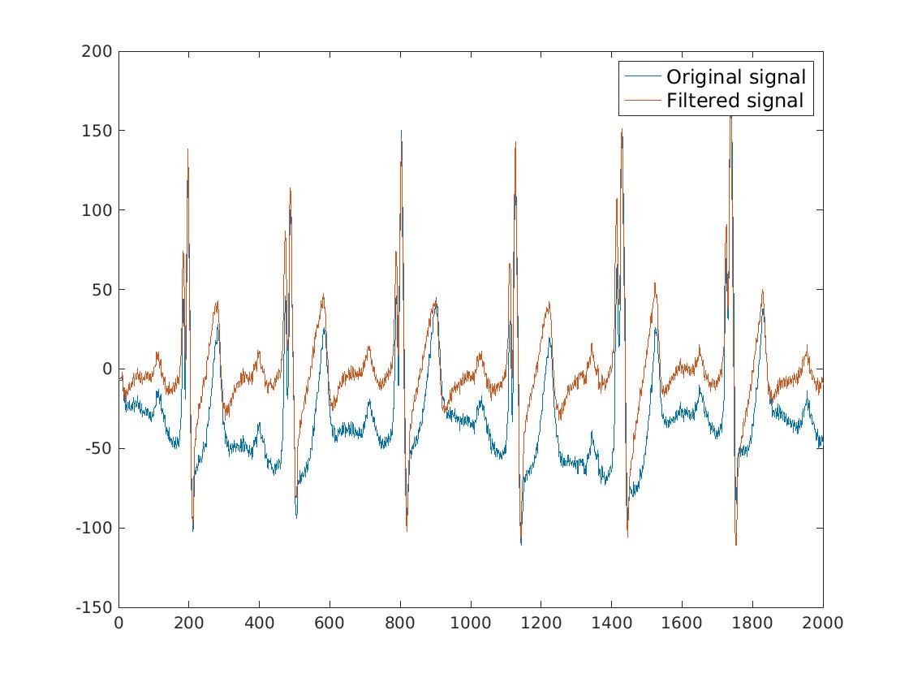

# QRS complex classification (normal, abnormal) using norms of linear algebra
# Abstract
We implemented a model for QRS complex classification using different norms of linear algebra. Our system is able to differentiate between normal and abnormal heart beats that are caused by ventricular ectopic. We first filter raw ECG signal with high pass filter to remove baseline drift. Than two different strategies for initial threshold are shown. We compare QRS complexes between each other using three different norms by itself or in majority voting schema. Best model is chosen in respect to the domain that it is used in and trade-off between sensitivity and specificity.

*Signal before and after baseline drift suppresion.*

# Results
|Name         |Se       | Sp        | +P        |
|-----------------|--------------|----------------|----------------|
|1-D1 | 90.9 | 94.0 | 99.4  |
|1-D2  | 90.5 | 94.8 | 99.4  |
|1-Dinf  | **91.4** | **95.5** | **99.5**  |

Name         |Se       | Sp        | +P        |
|-----------------|--------------|----------------|----------------|
|2-D1  | 91.5 | 98.1 | 99.8  |
|2-D2  | 90.8 | **98.7** | **99.8**  |
|2-Dinf  | 90.9 | 95.0 | 99.5  |
|2-D1-Adapt  | 96.6 | 95.0 | 99.5  |
|2-D2-Adapt  | **96.6** | 95.0 | 99.5  |
|2-Dinf-Adapt  | 93.2 | 92.1 | 99.2  |

Name         |Se       | Sp        | +P        |
|-----------------|--------------|----------------|----------------|
|2-MV | 90.8 | 94.7 | 99.4  |
|2-MV-Adapt | **90.9** | **98.1** | **99.8**  |

# Instructions for running detector on whole database
- Have a folder named "mitbihDB" where all files from the database are stored
- For every signal file in the database generate .mat file
- Comment/Uncomment parts of QRSClassify1.m/QRSClassify2.m to run different version of the classifier
- In Matlab run "runClassifier.m" with parameter "mitbihDB"
- Put run_classification.sh inside folder where your results are
- Run run_classification.sh with with optional parameter whicih specific name of resulting .txt file

# Reference
[1] H. Chen and S. Chen, “A moving average based filtering
system with its application to real-time QRS detection,” inComputers in Cardiology, 2003, IEEE, 2003.
[2] S. Chen and H. Chen, “Development of a real-timeQRS beat classifier using a nonlinear trimmed movingaveraging-based system,” in Computers in Cardiology,
2003, IEEE, 2003.
[3] G. Moody and R. Mark, “The impact of the MIT-BIH
arrhythmia database,” IEEE Engineering in Medicine andBiology Magazine, vol. 20, no. 3, pp. 45–50, 2001.
[4] A. L. Goldberger, L. A. N. Amaral, L. Glass, J. M.Hausdorff, P. C. Ivanov, R. G. Mark, J. E. Mietus, G. B.
Moody, C.-K. Peng, and H. E. Stanley, “PhysioBank,PhysioToolkit, and PhysioNet,” Circulation, vol. 101,June 2000.
